---
## Front matter
title: "Лабораторная работа #6"
subtitle: "НБИбд-01-22"
author: "Гриневич Юлия Алексеевна"

## Generic otions
lang: ru-RU
toc-title: "Содержание"

## Bibliography
bibliography: bib/cite.bib
csl: pandoc/csl/gost-r-7-0-5-2008-numeric.csl

## Pdf output format
toc: true # Table of contents
toc-depth: 2
lof: true # List of figures
lot: true # List of tables
fontsize: 12pt
linestretch: 1.5
papersize: a4
documentclass: scrreprt
## I18n polyglossia
polyglossia-lang:
  name: russian
  options:
	- spelling=modern
	- babelshorthands=true
polyglossia-otherlangs:
  name: english
## I18n babel
babel-lang: russian
babel-otherlangs: english
## Fonts
mainfont: PT Serif
romanfont: PT Serif
sansfont: PT Sans
monofont: PT Mono
mainfontoptions: Ligatures=TeX
romanfontoptions: Ligatures=TeX
sansfontoptions: Ligatures=TeX,Scale=MatchLowercase
monofontoptions: Scale=MatchLowercase,Scale=0.9
## Biblatex
biblatex: true
biblio-style: "gost-numeric"
biblatexoptions:
  - parentracker=true
  - backend=biber
  - hyperref=auto
  - language=auto
  - autolang=other*
  - citestyle=gost-numeric
## Pandoc-crossref LaTeX customization
figureTitle: "Рис."
tableTitle: "Таблица"
listingTitle: "Листинг"
lofTitle: "Список иллюстраций"
lotTitle: "Список таблиц"
lolTitle: "Листинги"
## Misc options
indent: true
header-includes:
  - \usepackage{indentfirst}
  - \usepackage{float} # keep figures where there are in the text
  - \floatplacement{figure}{H} # keep figures where there are in the text
---

# Цель работы

Добавить к сайту данные о себе.

    Список добавляемых данных.
        Разместить фотографию владельца сайта.
        Разместить краткое описание владельца сайта (Biography).
        Добавить информацию об интересах (Interests).
        Добавить информацию от образовании (Education).
    Сделать пост по прошедшей неделе.
    Добавить пост на тему по выбору:
        Управление версиями. Git.
        Непрерывная интеграция и непрерывное развертывание (CI/CD).
.

# Выполнение лабораторной работы

1. Записала название файлов /etc  . (рис. [-@fig:001]) в file.txt 

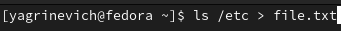{#fig:001 width=90%}

##

2. Добавляю в file.txt названия файлов из домашнего каталога. (рис. [-@fig:002])

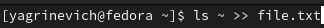{#fig:002 width=90%}

##

3. Вывожу названия файлов из file.txt с расширением .conf. (рис. [-@fig:003])

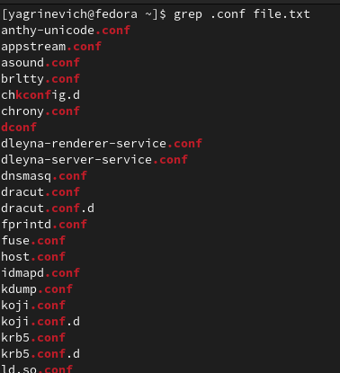{#fig:003 width=90%}

##

4. Переписываю файлы в новый файл conf.txt. (рис. [-@fig:004]) 

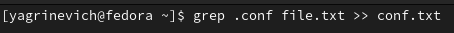{#fig:004 width=90%}

##

5. Ищу файлы содержащие 'c' на первом месте. (рис. [-@fig:005])

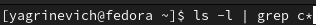{#fig:005 width=90%}

##

6. Делаю тоже действие, но другим способом  (рис. [-@fig:006])

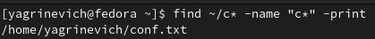{#fig:006 width=90%}

##

7. Файлы, начинающиеся с символа h вывожу из каталога /etc , (рис. [-@fig:007])

{#fig:007 width=90%}

##

8.  Запускаю  процесс и записываю его в файл logfile, в который запишутся только те, у которых название начинается с log. (рис. [-@fig:008])

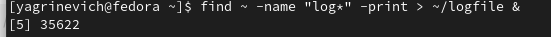{#fig:008 width=90%}

##

9. Удаляю файл logfile. (рис. [-@fig:009])

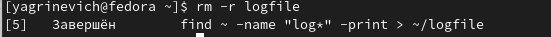{#fig:009 width=90%}

##

10. Запускаю gedit в фоне. (рис. [-@fig:010])

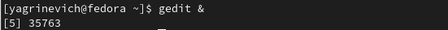{#fig:010 width=90%}

##

11. Проверяю работающие в фоне приложения. (рис. [-@fig:011])

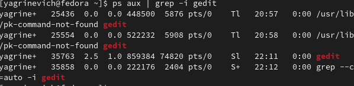{#fig:011 width=90%}

##

12. Получаю подробное описание команды kill. (рис. [-@fig:012])

{#fig:012 width=90%}

##

13. Закрываю gedit. (рис. [-@fig:013])

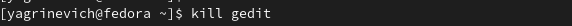{#fig:013 width=90%}
::: {#refs}
:::
