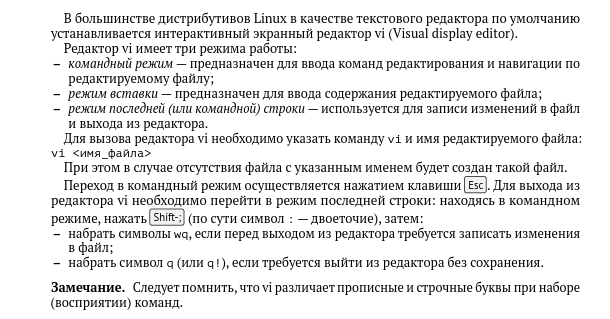

---
## Front matter
title: "Шаблон отчёта по лабораторной работе номер 8"
subtitle: "Простейший вариант"
author: "Гриневич Юлия Алексеевна"

## Generic otions
lang: ru-RU
toc-title: "Содержание"

## Bibliography
bibliography: bib/cite.bib
csl: pandoc/csl/gost-r-7-0-5-2008-numeric.csl

## Pdf output format
toc: true # Table of contents
toc-depth: 2
lof: true # List of figures
lot: true # List of tables
fontsize: 12pt
linestretch: 1.5
papersize: a4
documentclass: scrreprt
## I18n polyglossia
polyglossia-lang:
  name: russian
  options:
	- spelling=modern
	- babelshorthands=true
polyglossia-otherlangs:
  name: english
## I18n babel
babel-lang: russian
babel-otherlangs: english
## Fonts
mainfont: PT Serif
romanfont: PT Serif
sansfont: PT Sans
monofont: PT Mono
mainfontoptions: Ligatures=TeX
romanfontoptions: Ligatures=TeX
sansfontoptions: Ligatures=TeX,Scale=MatchLowercase
monofontoptions: Scale=MatchLowercase,Scale=0.9
## Biblatex
biblatex: true
biblio-style: "gost-numeric"
biblatexoptions:
  - parentracker=true
  - backend=biber
  - hyperref=auto
  - language=auto
  - autolang=other*
  - citestyle=gost-numeric
## Pandoc-crossref LaTeX customization
figureTitle: "Рис."
tableTitle: "Таблица"
listingTitle: "Листинг"
lofTitle: "Список иллюстраций"
lotTitle: "Список таблиц"
lolTitle: "Листинги"
## Misc options
indent: true
header-includes:
  - \usepackage{indentfirst}
  - \usepackage{float} # keep figures where there are in the text
  - \floatplacement{figure}{H} # keep figures where there are in the text
---

# Цель работы

Познакомиться с операционной системой Linux. Получить практические навыки рабо-
ты с редактором vi, установленным по умолчанию практически во всех дистрибутивах

# Задание

Здесь приводится описание задания в соответствии с рекомендациями
методического пособия и выданным вариантом.

# Теоретическое введение

Здесь описываются теоретические аспекты, связанные с выполнением работы.

Например, в табл. @tbl:std-dir приведено краткое описание стандартных каталогов Unix.

: Описание некоторых каталогов файловой системы GNU Linux {#tbl:std-dir}

| Имя каталога | Описание каталога                                                                                                          |
|--------------|----------------------------------------------------------------------------------------------------------------------------|
| `/`          | Корневая директория, содержащая всю файловую                                                                               |
| `/bin `      | Основные системные утилиты, необходимые как в однопользовательском режиме, так и при обычной работе всем пользователям     |
| `/etc`       | Общесистемные конфигурационные файлы и файлы конфигурации установленных программ                                           |
| `/home`      | Содержит домашние директории пользователей, которые, в свою очередь, содержат персональные настройки и данные пользователя |
| `/media`     | Точки монтирования для сменных носителей                                                                                   |
| `/root`      | Домашняя директория пользователя  `root`                                                                                   |
| `/tmp`       | Временные файлы                                                                                                            |
| `/usr`       | Вторичная иерархия для данных пользователя                                                                                 |

Более подробно об Unix см. в [@gnu-doc:bash;@newham:2005:bash;@zarrelli:2017:bash;@robbins:2013:bash;@tannenbaum:arch-pc:ru;@tannenbaum:modern-os:ru].

# Выполнение лабораторной работы

1. Осваиваю теоретический материал. рис. [-@fig:001])

{#fig:001 width=90%}

##

2. Просматриваю информацию о редакторе vi/.рис. [-@fig:002])

{#fig:002 width=90%}

##

3. Создаю каталог os/lab06.(рис. [-@fig:003])

{#fig:003 width=90%}

##

4. Открываю lab06/. (рис. [-@fig:004]) 

{#fig:004 width=90%}

##

5. Создаю файл и открываю его с помощью редактора vi. (рис. [-@fig:005])

{#fig:005 width=90%}

##
6. Пользуясь соответствующими функциями вставляю текст. (рис. [-@fig:006])

{#fig:006 width=90%}

##
7. Вставляю текст. (рис. [-@fig:007])

{#fig:007 width=90%}

##

8. Выхожу, предварительно сохранившись. (рис. [-@fig:008])

{#fig:008 width=90%}

##

9. Делаю файл исполняемым. (рис. [-@fig:009])

{#fig:009 width=90%}

##

10. Вызываю vi редактор. (рис. [-@fig:010])

{#fig:010 width=90%}

##

11. Меняю HELL на HELLO. (рис. [-@fig:011])

{#fig:011 width=90%}

##

12. Cтираю слово LOCAL. (рис. [-@fig:012])

{#fig:012 width=90%}

##

13.Пишу на его месте local. (рис. [-@fig:013])

{#fig:013 width=90%}

##

14. Перехожу в конец файла и пишу echo $HELLO. (рис. [-@fig:014])

{#fig:014 width=90%}

##

15. Отменяю последнюю команду. (рис. [-@fig:015])

{#fig:015 width=90%}

##

16. Сохраняю и выхожу из файла hello.sh. (рис. [-@fig:016])

{#fig:016 width=90%}

# Выводы

Научилась пользоваться редактором vi, его командами и функциями.

- 1. Режимы работы редактора vi:
- Командный режим (Command mode) - используется для перемещения по тексту, удаления, копирования и вставки текста, поиска и замены.
- Режим вставки (Insert mode) - используется для ввода текста.
- Режим замены (Replace mode) - используется для замены символов в тексте.
- Режим визуализации (Visual mode) - используется для выделения текста.

- 2. Для выхода из редактора без сохранения изменений нужно нажать комбинацию клавиш Esc :q! и нажать Enter.

- 3. Команды позиционирования:
- h - перемещение курсора влево на один символ.
- j - перемещение курсора вниз на одну строку.
- k - перемещение курсора вверх на одну строку.
- l - перемещение курсора вправо на один символ.
- 0 - перемещение курсора в начало строки.
- $ - перемещение курсора в конец строки.
- w - перемещение курсора на начало следующего слова.
- b - перемещение курсора на начало предыдущего слова.

- 4. В редакторе vi словом является последовательность символов, разделенная пробелами или символами перевода строки.

- 5. Для перехода в начало файла нужно нажать комбинацию клавиш Esc gg, для перехода в конец файла - Esc G.

- 6. Основные группы команд редактирования:
- Удаление (Deletion) - команды для удаления символов, слов, строк.
- Копирование и вставка (Copy and Paste) - команды для копирования и вставки текста.
- Замена (Replace) - команды для замены символов.
- Поиск и замена (Search and Replace) - команды для поиска и замены текста.
- Изменение (Change) - команды для изменения текста.
- Выделение (Selection) - команды для выделения текста.

- 7. Для заполнения строки символами $ нужно находиться в командном режиме, поставить курсор на начало строки и ввести команду 80i$ (если нужно заполнить 80 символов).

- 8. Для отмены некорректного действия нужно нажать комбинацию клавиш Esc u.

- 9. Основные группы команд режима последней строки:
- Сохранение (Saving) - команда для сохранения изменений в файле.
- Выход (Exit) - команда для выхода из редактора.
- Поиск и замена (Search and Replace) - команды для поиска и замены текста.
- Открытие файла (Open file) - команда для открытия нового файла.

- 10. Для определения позиции конца строки без перемещения курсора нужно нажать комбинацию клавиш $.

- 11. Редактор vi имеет множество опций, которые можно установить при запуске редактора или в процессе работы. Опции можно узнать, введя команду :set в командном режиме.

- 12. Режим работы редактора vi можно определить по символу, который отображается в левом нижнем углу экрана:
- -- INSERT -- - режим вставки.
- -- REPLACE -- - режим замены.
- -- VISUAL -- - режим визуализации.
- Пустая строка - командный режим.

- 13. Граф взаимосвязи режимов работы редактора vi:
[Командный режим] -> [Режим вставки]
[Командный режим] -> [Режим замены]
[Командный режим] -> [Режим визуализации]
[Режим вставки] -> [Командный режим]
[Режим замены] -> [Командный режим]
[Режим визуализации] -> [Командный режим]

# Список литературы{.unnumbered}

::: {#refs}
:::
