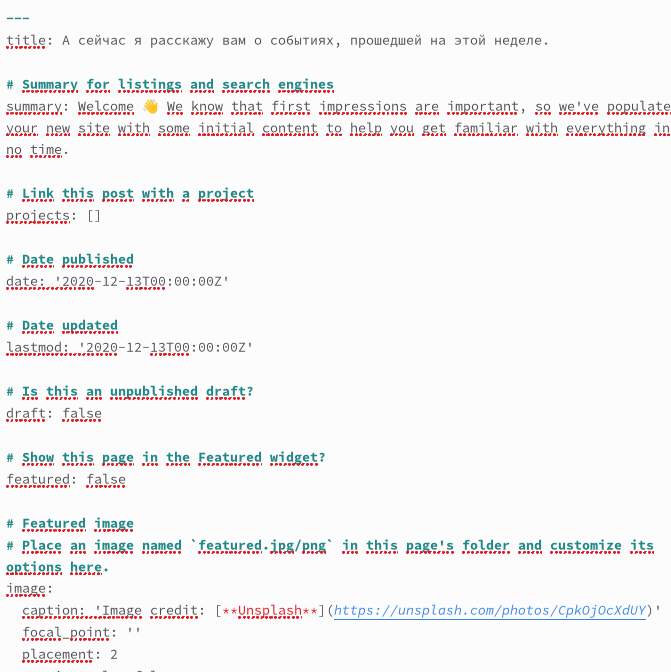
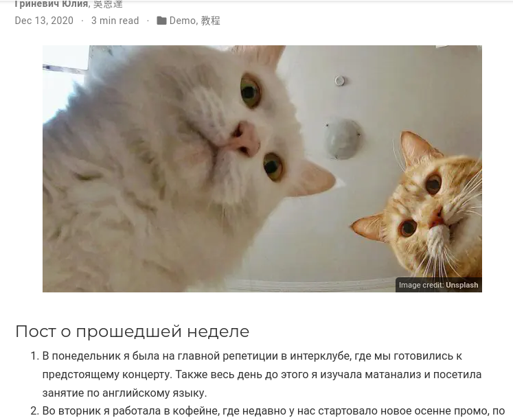

---
## Front matter
title: "Второй этап индивидуального проекта"
subtitle: "НБИбд-01-22"
author: "Гриневич Юлия Алексеевна"

## Generic otions
lang: ru-RU
toc-title: "Содержание"

## Bibliography
bibliography: bib/cite.bib
csl: pandoc/csl/gost-r-7-0-5-2008-numeric.csl

## Pdf output format
toc: true # Table of contents
toc-depth: 2
lof: true # List of figures
lot: true # List of tables
fontsize: 12pt
linestretch: 1.5
papersize: a4
documentclass: scrreprt
## I18n polyglossia
polyglossia-lang:
  name: russian
  options:
	- spelling=modern
	- babelshorthands=true
polyglossia-otherlangs:
  name: english
## I18n babel
babel-lang: russian
babel-otherlangs: english
## Fonts
mainfont: PT Serif
romanfont: PT Serif
sansfont: PT Sans
monofont: PT Mono
mainfontoptions: Ligatures=TeX
romanfontoptions: Ligatures=TeX
sansfontoptions: Ligatures=TeX,Scale=MatchLowercase
monofontoptions: Scale=MatchLowercase,Scale=0.9
## Biblatex
biblatex: true
biblio-style: "gost-numeric"
biblatexoptions:
  - parentracker=true
  - backend=biber
  - hyperref=auto
  - language=auto
  - autolang=other*
  - citestyle=gost-numeric
## Pandoc-crossref LaTeX customization
figureTitle: "Рис."
tableTitle: "Таблица"
listingTitle: "Листинг"
lofTitle: "Список иллюстраций"
lotTitle: "Список таблиц"
lolTitle: "Листинги"
## Misc options
indent: true
header-includes:
  - \usepackage{indentfirst}
  - \usepackage{float} # keep figures where there are in the text
  - \floatplacement{figure}{H} # keep figures where there are in the text
---

# Цель работы

Добавить к сайту данные о себе.

    Список добавляемых данных.
        Разместить фотографию владельца сайта.
        Разместить краткое описание владельца сайта (Biography).
        Добавить информацию об интересах (Interests).
        Добавить информацию от образовании (Education).
    Сделать пост по прошедшей неделе.
    Добавить пост на тему по выбору:
        Управление версиями. Git.
        Непрерывная интеграция и непрерывное развертывание (CI/CD).
.

# Выполнение лабораторной работы

1. Открыла директорию /work/blog и запустила hugo server. (рис. [-@fig:001])

{#fig:001 width=90%}

##

2. Меняю фотографию. (рис. [-@fig:002])

{#fig:002 width=90%}

##

3. Открыла _index.md ,и написала краткую биографию. (рис. [-@fig:003])

{#fig:003 width=90%}

##

4. Написала биографию и сохранила файл. (рис. [-@fig:004]) 

{#fig:004 width=90%}

##

5. Сравнила результаты. (рис. [-@fig:005])

{#fig:005 width=90%}

##

6. Открыла каталог post, чтобы отредактировать посты на сайте. (рис. [-@fig:006])

{#fig:006 width=90%}

##

7. Сменила фото в первом посте (рис. [-@fig:007])

{#fig:007 width=90%}

##

8.  Открыла файл index.md и создала пост про прошлую неделю. (рис. [-@fig:008])

{#fig:008 width=90%}

##

9. Сравнила итог. (рис. [-@fig:009])

{#fig:009 width=90%}

##

10. Перешла в другой каталог и заменила фото. (рис. [-@fig:010])

{#fig:010 width=90%}

##

11. Открыла файл index.md и написала пост непрерывной интеграции и непрерывном развертывании (CI/CD).. (рис. [-@fig:011])

{#fig:011 width=90%}

##

12. Сверяюсь о готовности результата. (рис. [-@fig:012])

{#fig:012 width=90%}

##

::: {#refs}
:::
