---
## Front matter
title: "3 этап индивидуального проекта"
subtitle: "Вариант выполнения"
author: "Гриневич Юлия Алексеевна"

## Generic otions
lang: ru-RU
toc-title: "Содержание"

## Bibliography
bibliography: bib/cite.bib
csl: pandoc/csl/gost-r-7-0-5-2008-numeric.csl

## Pdf output format
toc: true # Table of contents
toc-depth: 2
lof: true # List of figures
lot: true # List of tables
fontsize: 12pt
linestretch: 1.5
papersize: a4
documentclass: scrreprt
## I18n polyglossia
polyglossia-lang:
  name: russian
  options:
	- spelling=modern
	- babelshorthands=true
polyglossia-otherlangs:
  name: english
## I18n babel
babel-lang: russian
babel-otherlangs: english
## Fonts
mainfont: PT Serif
romanfont: PT Serif
sansfont: PT Sans
monofont: PT Mono
mainfontoptions: Ligatures=TeX
romanfontoptions: Ligatures=TeX
sansfontoptions: Ligatures=TeX,Scale=MatchLowercase
monofontoptions: Scale=MatchLowercase,Scale=0.9
## Biblatex
biblatex: true
biblio-style: "gost-numeric"
biblatexoptions:
  - parentracker=true
  - backend=biber
  - hyperref=auto
  - language=auto
  - autolang=other*
  - citestyle=gost-numeric
## Pandoc-crossref LaTeX customization
figureTitle: "Рис."
tableTitle: "Таблица"
listingTitle: "Листинг"
lofTitle: "Список иллюстраций"
lotTitle: "Список таблиц"
lolTitle: "Листинги"
## Misc options
indent: true
header-includes:
  - \usepackage{indentfirst}
  - \usepackage{float} # keep figures where there are in the text
  - \floatplacement{figure}{H} # keep figures where there are in the text
---

# Цель работы

Дополнить информацию об авторе, рассказать о навыках, опыте, а также сделать две публикации.

# Задание

Написать пост о прошедшей неделе и пост на свободную тему.

# Выполнение лабораторной работы

1. Открываю директорию /work/blog/content и _index.md. (рис. [-@fig:001])

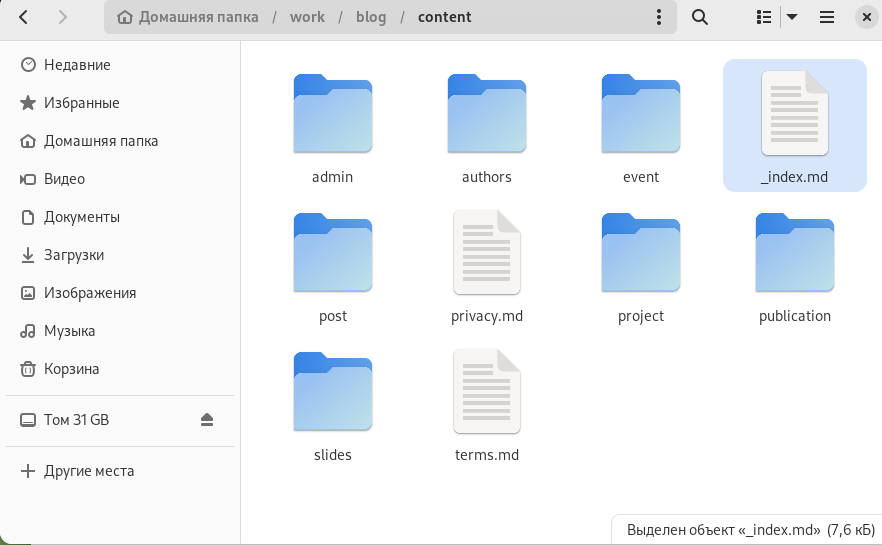{#fig:001 width=90%}

##

2. Изменяю "Skills" на "Умения". (рис. [-@fig:002])

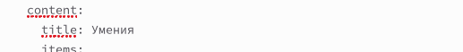{#fig:002 width=90%}

##

3. Контролирую выполнение. (рис. [-@fig:003])

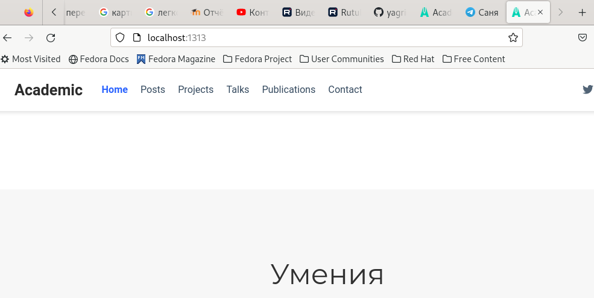{#fig:003 width=90%}

##

4. Заменяю "Experince" на "Опыт", изменяю названия заголовков, пишу информацию о себе (рис. [-@fig:004]) 

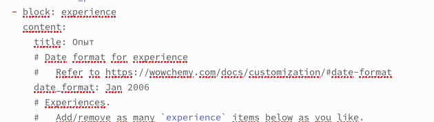{#fig:004 width=90%}

##

5. Сравниваю результат. (рис. [-@fig:005])

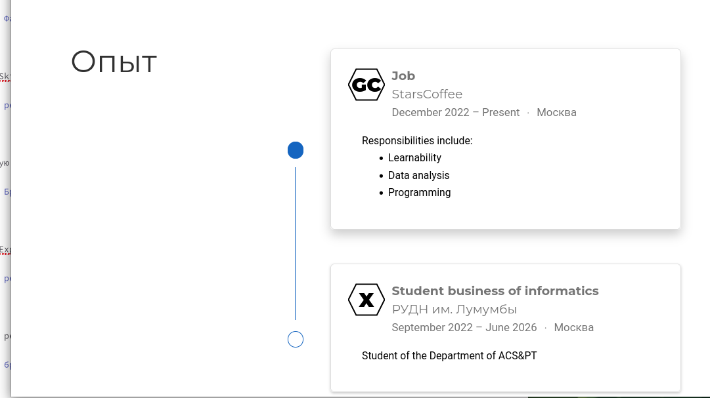{#fig:005 width=90%}

##

6. Меняю "Achievements"> "Достижения", рассказываю о достижениях. (рис. [-@fig:006])

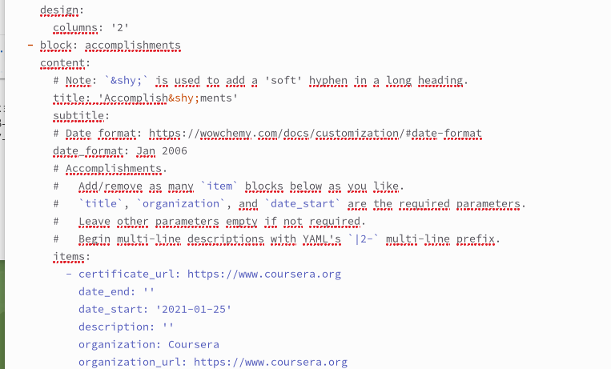{#fig:006 width=90%}

##

7. Сравниваю результат. (рис. [-@fig:007])

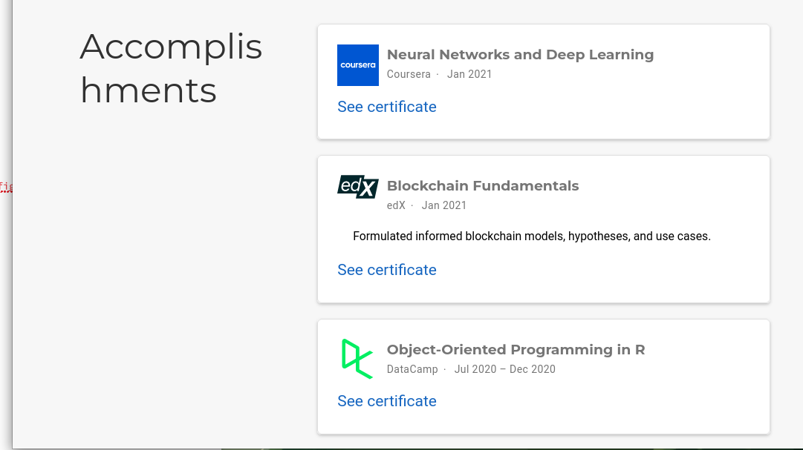{#fig:007 width=90%}

##

8.  Меняю "Recent posts" на "Последние посты". (рис. [-@fig:008])

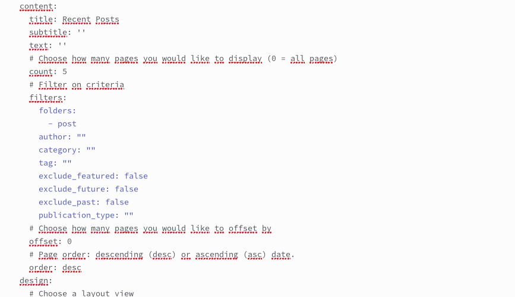{#fig:008 width=90%}

##

9. Смотрю на результат. (рис. [-@fig:009])

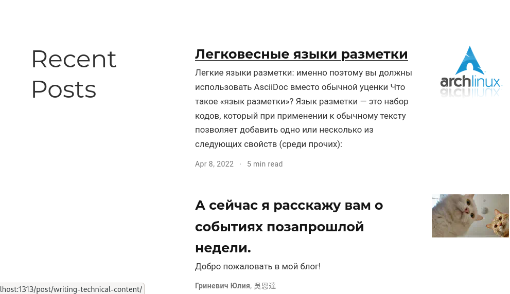{#fig:009 width=90%}

##

10. Перехожу в каталог work/blog/content/post/lproshlaya . (рис. [-@fig:010])

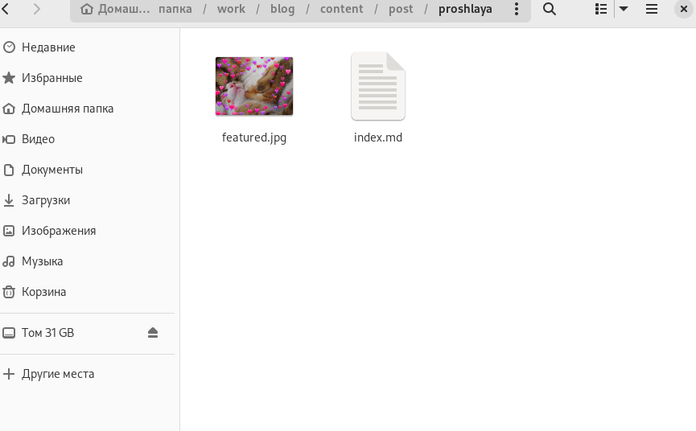{#fig:010 width=90%}

##

11. Открываю файл index.md и пишу пост о прошлой неделе. (рис. [-@fig:011])

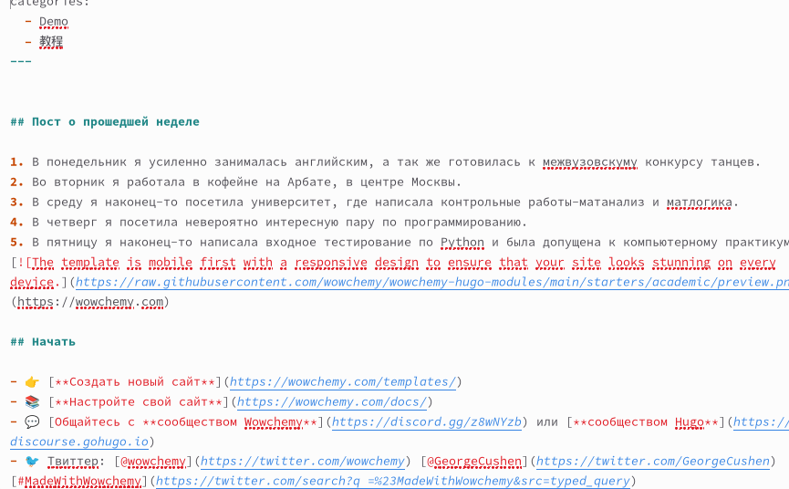{#fig:011 width=90%}

##

12. Смотрю на результат в браузере. (рис. [-@fig:012])

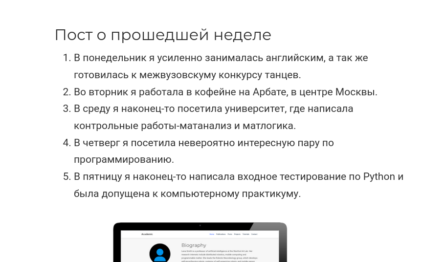{#fig:012 width=90%}

##

13. Перехожу в каталог work/blog/content/post/Язык разметки Latex. (рис. [-@fig:013])

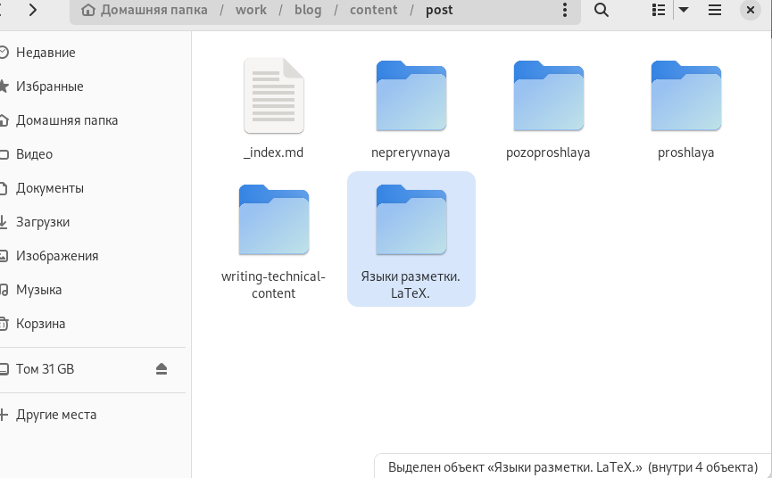{#fig:013 width=90%}

##

14. Открываю файл index.md и пишу пост о легковесных языках разметки. (рис. [-@fig:014])

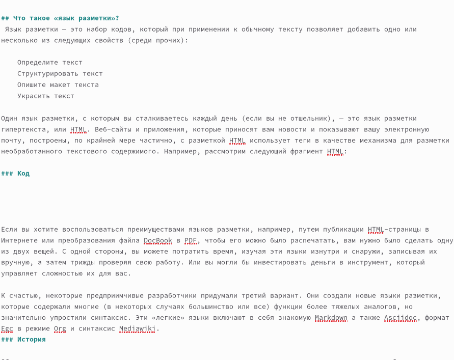{#fig:014 width=90%}

##

15. Смотрю на результат. (рис. [-@fig:015])

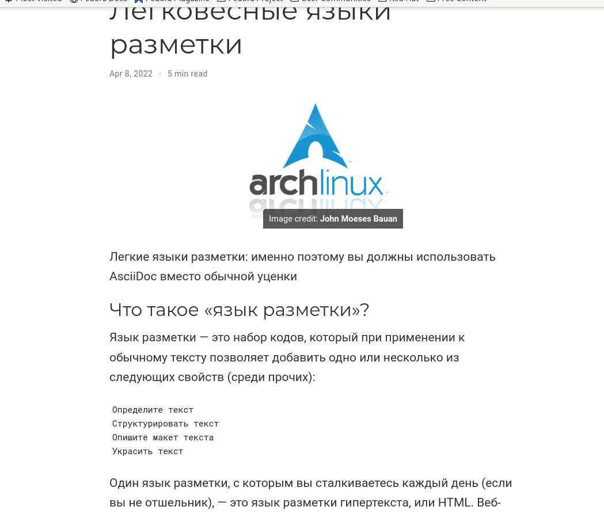{#fig:015 width=90%}

# Выводы

Я научилась добавлять и изменять информацию на github.io.

# Список литературы{.unnumbered}

::: {#refs}
:::
